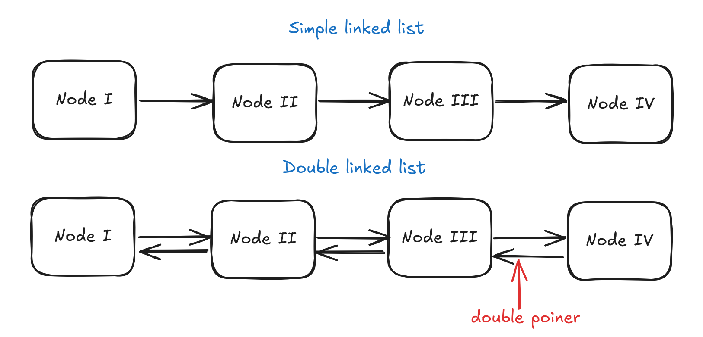
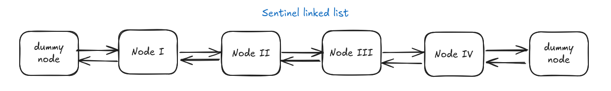
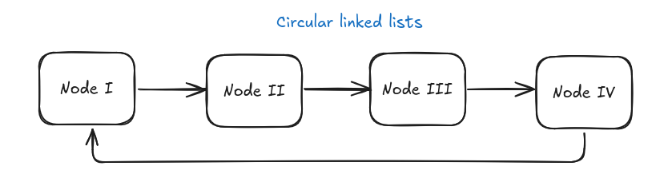
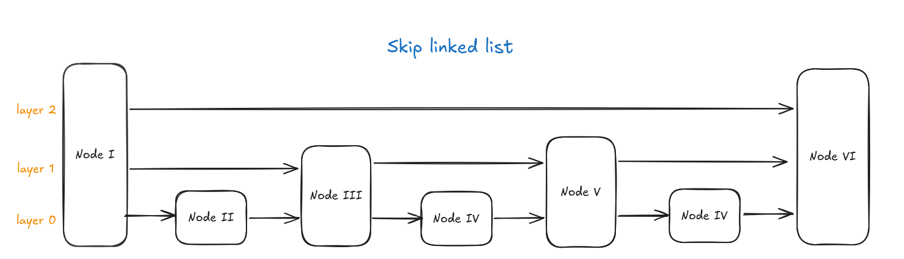

import AdvantageComparison from '../../Components/Blog_Components/AdvantageComparison.astro';
import CollapsibleElement from '../../Components/Blog_Components/CollapsibleElement.astro';
import ComplexityComponent from '../../Components/Blog_Components/ComplexityComponent.astro'

## What is a linked list

A linked list is a data structure that represents a collection of elements
that are stored in different regions of memory, each element being linked
to the rest with the help of pointers. We say that a list is formed by 
**nodes** which contain data and a pointer to the next node.

There are diffrent types of linked list, the type being determined by the number
of links to the other elements a node has. For example, a node of a simple linked
list has just a pointer to the next element, while one of a double linked list has two pointers:
one to the previous element and one to the next one. 

Here's a visual representation of the two types:



<AdvantageComparison 
    title="Linked lists - Pros & Cons"
  advantages={[
    'the only memory constraint is the heap size',
    'the size can be dynamically changed in O(1) time complexity'
  ]} 
  disadvantages={[
    'cannot be randomly accessed, it needs to be iterated element by element'
  ]}
/>

<ComplexityComponent 
  title="Time complexity for common operations"
  operations={[
    { name: "Insert at Head", complexity: "O(1)" },
    { name: "Insert at Tail", complexity: "O(n)" },
    { name: "Search Element", complexity: "O(n)" },
    { name: "Delete at Head", complexity: "O(1)" }
  ]}
/>
## Types of linked lists

### Sentinel linked lists

    - **structure**: the first (or last node; or both) contains a dummy node that is called the sentinel node, which doesn't contain data,
    but instead it only contains a reference to the first (or last) valid node
    - **advantages**: eliminate the edge cases of a list being empty in case of insertion or of deleting the last element. In this way
    the code is cleaner and standardized



### Circular linked lists

    - **structure**: the final node in the list doesn't point to null, but instead it points to the first element
    - **advantages**: it's best for continuous looping aplications



### Skip linked lists

    - **structure**: at base, it is a simple linked list, but it has multiple layers. The layers above act as express lanes, where
    each high layer skips a portion of elements
    - **advantages**: in case of sorted lists, it increases the insert/delete/find operation to O(logN) complexity




### Revision - implementing a simple linked list in C
<CollapsibleElement summary="See code">
    ```cpp
    typedef struct ListNode
{
    void *item; // generic data can be stored
    struct ListNode *next;
} ListNode;

ListNode *create_node(void *data)
{
    ListNode *new_node = malloc(sizeof(ListNode));
    new_node->item = data;
    new_node->next = NULL;
    return new_node;
}

// inserts node at the start of the list
ListNode *insert_node_first(ListNode *head, void *data)
{
    // creating new node
    ListNode *new_node = create_node(data);
    new_node->next = head;

    return new_node;
}

// inserts node at the end of the list
ListNode *insert_node_last(ListNode *head, void *data)
{
    // creating new node
    ListNode *new_node = create_node(data);
    new_node->next = NULL;

    // iterating until the end elem
    ListNode *p = head;

    if (p == NULL)
    { // the list is empty
        return new_node;
    }

    while (p->next != NULL)
        p = p->next;
    // p is now the last node
    p->next = new_node;

    return head;
}

// inserts node after a certain element given
ListNode *insert_node(ListNode *head, void *new_node_data, void *ref_data, int (*cmp)(void *, void *))
{
    if (head == NULL)
        return head; // empty list, cannot insert after it

    ListNode *p = head;

    while (p->next != NULL && cmp(p->item, ref_data) == 0)
    {
        p = p->next;
    }

    if (cmp(p->item, ref_data) == 0)
    { // didn't find the elem

        return head; // didn't find the element, nothing changed
    }

    // create node
    ListNode *new_node = create_node(new_node_data);

    if (p->next == NULL)
    { // insert after the last element
        p->next = new_node;
        new_node->next = NULL;
    }
    else
    { // normal case (inserting between two nodes)
        new_node->next = p->next;
        p->next = new_node;
    }

    return head;
}

// deletes a certain node
ListNode *delete_node(ListNode *head, void *ref_data, int (*cmp)(void *, void *))
{
    if (head == NULL)
        return head; // list is empty

    ListNode *p = head, *prev = NULL;
    // trying to find the element that's gonna be deleted, and the prev one
    while (p->next != NULL && cmp(p->item, ref_data) == 0)
    {
        prev = p;
        p = p->next;
    }

    if (cmp(p->item, ref_data) == 0) // node doesn't exist
        return head;

    if (prev == NULL)
    { // deleting first node
        p = head->next;
        free(head);
        return p;
    }

    // normal case
    prev->next = p->next;
    free(p);
    return head;
}
```
</CollapsibleElement>

## Linked lists in C++
